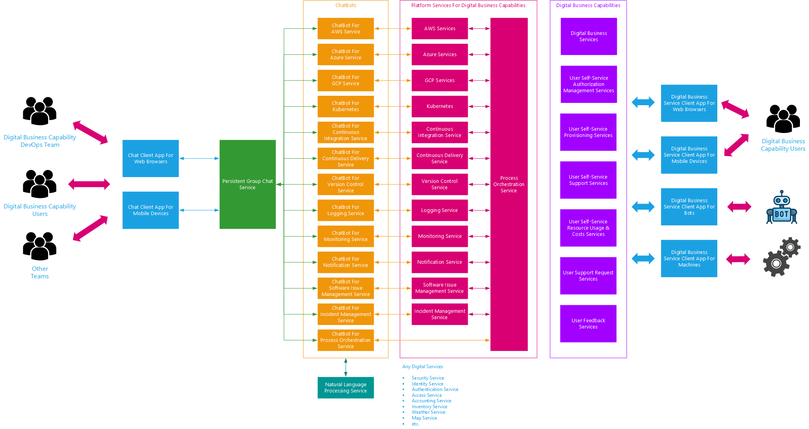

# Sample Google Chat Chatbot Using Google Apps Script

Sample chatbot to demonstrate various capabilities include:

- Receive messages from Google Chat
- Process slash commands
- Create simple and card Google Chat messages
- Connect to AWS services

These instructions are based on Google Cloud Platform, Google Apps Script, and Google Chat as of October, 2020.

## Architecture



## Prerequisites

- Hava a valid AWS access key and secret key pair
- Have a developer user account at Google Cloud Platform (https://console.developers.google.com/)

## Create A Google Apps Script Project

1. Navigate in a web browser to Google Apps Script - https://script.google.com/
1. Select "My Projects"
1. Select  "New project"
1. Type in the name of your project
1. Copy the files in this git repo over your Google Apps Script project using the same file names
1. If you want to log debug messages, set the debug variable in Code.gs to true
1. Select save button

## Configure Google Apps Script Script Properties 

1. From your Apps Script project screen, select File > "Project Properties"
1. Select the "Script properties" tab
1. Select "Add row"
1. In the property name field, type in "aws_iam_accesskey"
1. In the property value field, type in the AWS access key that you have access to
1. Select "Add row"
1. In the property name field, type in "aws_iam_secretkey"
1. In the property value field, type in the AWS secret key that is associated with the AWS access key
1. Select "Add row"
1. In the property name field, type in "aws_default_region"
1. In the property value field, type in the default AWS region (e.g. "us-east-2")
1. Select "Save"

## Configure Google Apps Script Script Manifest File

1. From your Apps Script project screen, select View and enable "Show manifest file" 
1. Edit the appsscript.json file
1. Add the following to JSON object:
````
{
  ....
  "chat": {
    "addToSpaceFallbackMessage": "Thank you for adding me!"
  }
  ....
}
````
1. Save the file

## Publish / Deploy Google Apps Script Project

1. From your Apps Script project screen, select Publish > "Deploy from manifest"
1. Note that there is a deployment called "Latest Version (Head)"
    1. This will point to your latest published version.
    1. Use the ID of this deployment to configure your Google Hangouts Chat API.
    1. Get the ID for this deployment by selecting "Get ID"
    1. Copy the "Deployment ID" value
    1. Select "Close"
1. Select "Create"
1. Type in a name for the deployment
1. Select "Save"

## (Optional) Hosting Google Chat Avatar Icon File Using GitHub Pages

If you want to customize the avatar icon that Google Chat uses for your chatbot and you need a place to host the icon file, you can use GitHub Pages.  If you store your git repo for this project in GitHub, this gives you the added convenience of storing the icon file with your source code.  To find a free icon, simply use Google Search with the search phrase "free bot icon".  Download the icon and add to your project repo.

1. Create a repo for your project on GitHub
1. Push your code to the repo with the icon file
1. Navigate to the Settings page for the repository
1. Scroll down to the "GitHub Pages" section
1. Select the source for your GitHub Pages for th project
1. Select "Save
1. Select "Choose a theme"
1. Select a theme
1. Use a web browser to navigate to your GitHub Pages for the project.  The URL follows the pattern: https://<GitHub username>.github.io/<repo name>
1. The URL to the icon file is: https://<GitHub username>.github.io/<repo name>/<path to icon file>
1. Use that URL when you configure Google Chat Hangouts API setting in you GCP project

## Create A Google Cloud Platform (GCP) Project

1. Read https://cloud.google.com/resource-manager/docs/creating-managing-projects
1. Navigate in a web browser to GCP Resource Manager - https://console.cloud.google.com/cloud-resource-manager
1. Select "Create Project"
1. NOTE: There seems to be a bug in GCP here where the new project does not appear on the webpage.  Simply refresh the webpage.

## (NOT NEEDED) Create A Service Account On Google Cloud Platform (GCP)

1. Navigate in a web browser to GCP Console - https://console.developers.google.com/
1. Select Navigation Menu (upper lefthand corner) > IAM & Admin > Service Accounts
1. Select the GCP project that you want to create the service account for
1. Select "Create Service Account"
1. Enter the service account details that you want to use
1. Select "Create"
1. Select "Done"
1. Select the "Email"(or Edit) of the new service account to navigate to the service account details
1. Select "Add Key"

## Enable & Configure Google Hangouts Chat API

1. Navigate in a web browser to GCP Console - https://console.developers.google.com/
1. Select Navigation Menu (upper lefthand corner) > API & Services > Library
1. Type "hangouts chat" in the search bar
1. Select "Hangouts Chat API"
1. If not already enabled, select "Enable"; otherwise, select "Manage"
1. Select "Configuration"
1. Set "Bot status" to "LIVE"
1. Set "Bot name" that will be the name used for the bot as it appears in Google Chat - use something easy to type (e.g. "aws")
1. Set "Functionality" to be enabled for both direct messages and rooms
1. Set "Connection settings" to "Apps Script project"
1. Set the Deployment ID for the deployment of your Google Apps Script implementation of your ChatBot (we recommend that you use the deployment ID that points to the Latest Version)
1. Set slash commands as follows:
  1. "/aws" = Command ID 1 with a description of "Issue AWS commands"
1. Set permissions to the individual users or user groups that you want to allow access to install the bot
1. Select "Save"

## Add ChatBot To Google Chat As Direct Message

1. Navigate in a web browser to Google Chats - https://chat.google.com/
1. Scroll down to the "Bots" section
1. Select the "+" symbol to add a bot
1. In the search bar, type in the name of the chatbot that you configured in the GCP Google Hangouts Chat API settings.
1. When you use a bot for the first time, you may get a response with a link displayed as "Configure"
1. Select "Configure" and allow the bot to have the authorizations it needs

## Test ChatBot In Google Chat

1. Once added, test out the bot commands such as:
    1. "/aws help"
    1. "/aws iam"
    1. "/aws vpc"
    1. "/aws s3"
    1. "/aws s3 ls"
    1. "/aws ec2"
1. NOTE:  When using the Google Chat slash commands, you will need to either select them from the list as you type the command or type the tab key.  Otherwise, Google Chat does not recognize the text literal "/aws" as a slash command.  (Stupid)

## View Apps Script Execution Logs

1. Navigate in a web browser to Google Apps Script Executions - https://script.google.com/home/executions
1. Select "My Executions"
1. Select the execution that you want to view - the details of the execution should expand
1. View the log messages created from the Logger.log statements

## Reference Information

- ECMAscript - https://tc39.es/ecma262/#sec-intro
- V8 Engine - https://v8.dev/
- Google Apps Script Guide - https://developers.google.com/apps-script/overview
- Google Apps Script Reference - https://developers.google.com/apps-script/reference
- Google Apps Script Manifest File for Google Chat API - https://developers.google.com/hangouts/chat/how-tos/bots-apps-script#manifest_file
- GCP Resource Manager - https://console.cloud.google.com/cloud-resource-manager
- GCP Developer Console - https://console.developers.google.com/
- GCP Hangouts Chat Bot - https://developers.google.com/hangouts/chat/how-tos/bots-publish
- AWS JavaScript Client - https://github.com/smithy545/aws-apps-scripts
- AWS JavaScript SDK (for reference - does not work in Google Apps Script) - https://github.com/aws/aws-sdk-js
- GitHub Pages - https://pages.github.com/
- Getting Started With GitHub Pages - https://docs.github.com/en/free-pro-team@latest/github/working-with-github-pages/getting-started-with-github-pages
